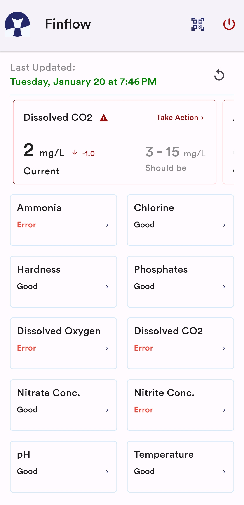

# FinFlow

Welcome to FinFlow, your ultimate solution for modern fish farming!

FinFlow is a comprehensive mobile application designed for fish farmers, offering real-time monitoring of crucial chemical factors within their fish ponds. Integrated with IoT technology, this app provides a seamless experience for users to track and manage their aquaculture environment efficiently.

## Key Features :sparkles:

### Mobile Application (Flutter-based)

- 📱 **User Authentication:** Secure phone authentication for user access.
- 📷 **QR Code Setup:** Effortless device setup via QR code scanning.
- 📊 **Real-time Monitoring:** Monitor chemical factors in fish ponds in real time.
- 📈 **Data Insights:** Real-time insights and computations for informed decisions.
- 🚨 **Push Notifications:** Receive alerts and updates even when the app is closed.
- 🔄 **Data Synchronization:** Instant data synchronization for up-to-date information.

### NodeMCU Functionality

- 🔌 **WiFi Configuration:** Real-time WiFi setup directly from the device.
- 💡 **LED Indicators:** Clear status indication with LEDs for connection and upload.
- ⏰ **Timestamping:** Automatic timestamp addition to collected data.
- 📡 **Data Upload:** Efficient upload of processed data to Firebase.
- 🔄 **Continuous Monitoring:** Constantly listens for serial data to ensure timely updates.

## Tech Stack :gear:

### Mobile Application

- **Framework:** Flutter
- **Backend Database:** Firebase Realtime Database
- **Authentication:** Phone Authentication

### NodeMCU

- **Library:** Firebase_ESP_Client
- **Communication:** I2C Serial Communication
- **WiFiManager:** To change wifi SSID and Password during runtime
- **NTPClient:** To fetch current time

## Getting Started :rocket:

### Prerequisites - Flutter App

1. Flutter SDK: Follow the official guide to [install Flutter](https://flutter.dev/docs/get-started/install).
2. Firebase Project: Set up a project on the [Firebase Console](https://console.firebase.google.com/), and obtain your configuration files.
3. Mobile Device or Emulator: You'll need a physical device or emulator to run the app.

### Prerequisites - NodeMCU (Using Firebase_ESP_Client Library)

1. Arduino IDE: Download and install the [Arduino IDE](https://www.arduino.cc/en/Main/Software).
2. Libraries: Install the required libraries - Firebase_ESP_Client, WifiManager and NTP.

### Setup

1. **Flutter App:**

   ```bash
   git clone https://github.com/yourusername/finflow.git
   cd finflow_app
   # Replace configuration files with Firebase project files
   flutter run

   ```

2. **Node MCU:**

   - Open the NodeMCU code in Arduino IDE
   - Update Firebase credentials in the code
   - Upload the code to NodeMCU

3. **Enjoy:** Explore the seamless world of FinFlow by monitoring your fish pond environment with ease!

## Screenshots

|               Login               |               Setup               |               Home               |
| :-------------------------------: | :-------------------------------: | :------------------------------: |
|  |  |  |

##
